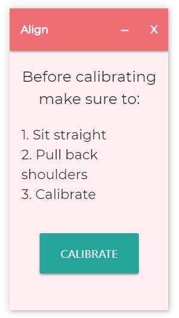
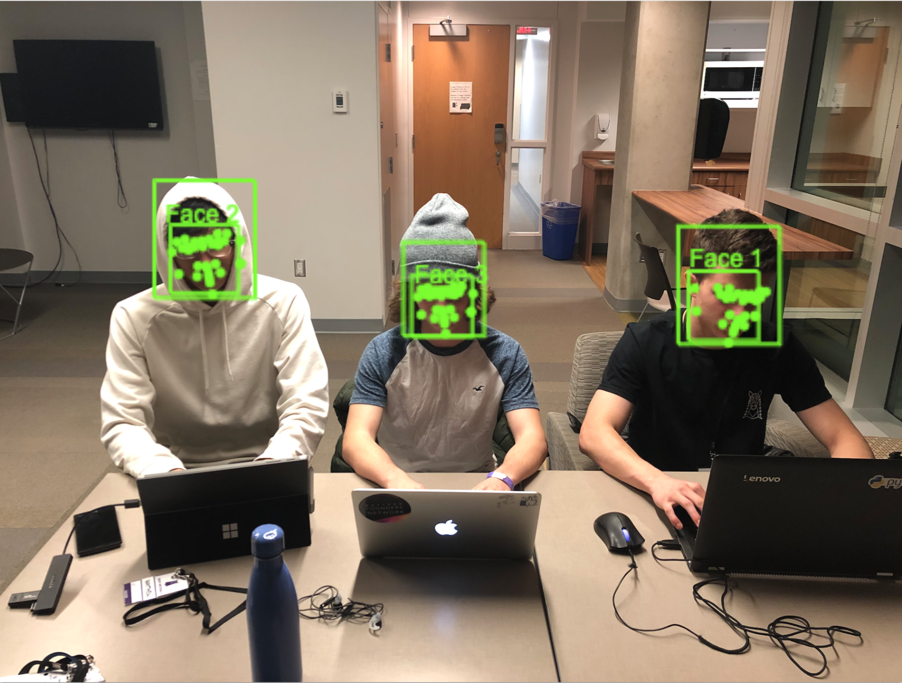

# Align
Bad posture is extremely common amongst individuals across North America. More emplyees across North America are required to spend longer periods of time seated infront of desktops or laptops, increasing the likelihood of developing bad posture habits. It is estimated that 70% of America's workforce complains about back pain cause by poor posture. It is one of the most common complaints amongst the human resource departments nationwide. Poor posture is the leading cause of disability amongst emplyees under the age of 45. Issues caused by poor posture has cost American employees 7 billion dollars. Bad posture can lead to:
- Soreness and Pain
- Poor circulation
- Negative mood
- Increased stress
- Carpal Tunnel Syndrome
- Less motivation
- Poor digestion
- Fatique
It is clear that now, more than ever, a solution is needed. That is why we decided to create **Align**. 

Align genlty alerts you when you lose good posture and helps you develop beneficial habits. Align was designed with the user experience in mind and it seamlessly integrates cutting edge technology into an easy to use application. Using Align is as simple as opening the application and clicking "calibrate" when you are ready. 

ElectronJS was used to build a cross platform desktop application that uses your webcam and Google Cloud's Vision recognition AI to periodically analyze your posture. Coupled with our in-house developed algorith, Align is able to recognize when your posture is not ideal and notify you accordingly. The user interface built with HTML and CSS.

We are prout to be able to tackle such a prominent issue that millions are facing everyday through an elegant and simple solution. Align will make a change in the workplace, school, and home.

